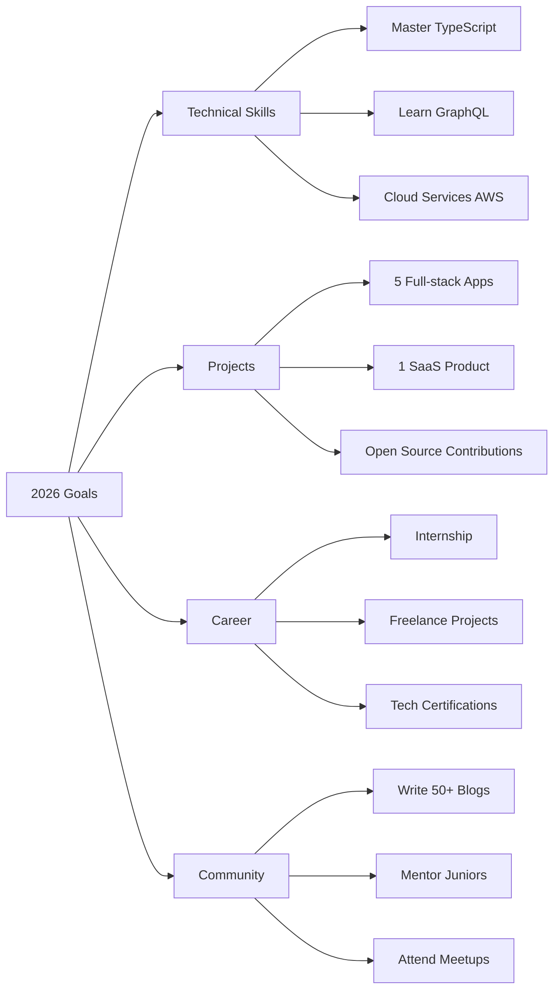

<div align="center">
  
  
  # 👋 Xin chào!  Tôi là Nhật Huy
  
  <p>
    <a href="https://github.com/Nhathuy2232">
      
    </a>
    <a href="https://www.linkedin.com/in/YOUR_PROFILE/">
      
    </a>
    <a href="mailto:your.email@example.com">
      
    </a>
  </p>
  
  
</div>

---

## 👨‍💻 Về tôi

```typescript
const huy = {
    role: "💻 Full-stack Developer",
    location: "📍 Việt Nam",
    education: "🎓 Computer Science Student",
    
    code: ["JavaScript", "TypeScript", "Python", "Java", "C++"],
    
    technologies: {
        frontend: {
            js: ["React", "Redux", "Next.js"],
            css: ["Tailwind", "Bootstrap", "Styled-Components"]
        },
        backend: {
            js: ["Node.js", "Express"],
            python: ["Flask", "Django"],
        },
        databases: ["MongoDB", "MySQL", "Firebase", "PostgreSQL"],
        tools:  ["Git", "Docker", "VS Code", "Postman", "Figma"]
    },
    
    currentlyLearning: ["TypeScript", "GraphQL", "AWS", "Microservices"],
    currentlyReading: ["Clean Code", "Design Patterns"],
    
    goals2026: [
        "🎯 Master Full-stack Development",
        "🚀 Launch 1 SaaS Product",
        "📝 Write 50+ Technical Blogs",
        "🤝 Contribute to Major Open Source Projects"
    ],
    
    funFact: "☕ Coffee + 🎵 Lo-fi + 💻 Code = Perfect Day"
};
```

<div align="center">

### 🏆 GitHub Profile Trophy


</div>

---

## 📊 GitHub Statistics

<div align="center">
  
  
</div>

<div align="center">
  
</div>

<div align="center">
  
</div>

---

## 💼 Tech Stack

<div align="center">

### Frontend Development


### Backend Development


### Database & Cloud


### Tools & Platforms


</div>

---

## 🚀 Featured Projects

<div align="center">

<table>
<tr>
<td width="50%">

### 🎓 Student Management System

[](https://github.com/Nhathuy2232/student-management)
[](https://your-demo-link.com)

**Tech Stack:**
- `React. js` `Node.js` `Express` `MongoDB`
- `JWT Auth` `REST API` `Responsive Design`

**Features:**
- ✅ CRUD operations for students
- ✅ User authentication & authorization
- ✅ Dashboard with statistics
- ✅ Search & filter functionality
- ✅ Export data to CSV


</td>
<td width="50%">

### 📝 Task Manager Pro

[](https://github.com/Nhathuy2232/task-manager)
[](https://your-demo-link.com)

**Tech Stack:**
- `React.js` `Redux Toolkit` `Tailwind CSS`
- `LocalStorage` `PWA` `Dark Mode`

**Features:**
- ✅ Create, edit, delete tasks
- ✅ Priority levels & categories
- ✅ Due dates & reminders
- ✅ Dark/Light theme toggle
- ✅ Drag & drop interface


</td>
</tr>

<tr>
<td width="50%">

### 🤖 AI Chatbot Assistant

[](https://github.com/Nhathuy2232/ai-chatbot)
[](https://your-demo-link.com)

**Tech Stack:**
- `Python` `Flask` `TensorFlow` `NLP`
- `NLTK` `Scikit-learn` `REST API`

**Features:**
- ✅ Natural language processing
- ✅ Intent recognition
- ✅ Sentiment analysis
- ✅ Context awareness
- ✅ Learning from conversations


</td>
<td width="50%">

### 🌐 Portfolio Website

[](https://github.com/Nhathuy2232/portfolio)
[](https://your-demo-link.com)

**Tech Stack:**
- `React.js` `Framer Motion` `Styled Components`
- `EmailJS` `Responsive` `SEO Optimized`

**Features:**
- ✅ Smooth scroll animations
- ✅ Dark/Light theme
- ✅ Contact form with email
- ✅ Projects showcase
- ✅ Fully responsive


</td>
</tr>
</table>

### 💡 More Projects

<details>
<summary><b>🔍 Click to see more projects</b></summary>
<br>

| Project | Description | Tech Stack | Links |
|---------|-------------|------------|-------|
| **🛒 E-Commerce Platform** | Full-featured online shopping website | React, Node.js, Stripe, MongoDB | [Repo](#) • [Demo](#) |
| **📊 Data Visualization Dashboard** | Interactive charts and analytics | React, D3.js, Chart.js | [Repo](#) • [Demo](#) |
| **🎵 Music Player** | Spotify-like music player | React, Context API, Web Audio API | [Repo](#) • [Demo](#) |
| **🔐 Auth System** | Complete authentication solution | Node.js, JWT, bcrypt, Passport.js | [Repo](#) • [Demo](#) |
| **📱 Weather App** | Real-time weather application | React, OpenWeather API, Geolocation | [Repo](#) • [Demo](#) |
| **📝 Markdown Editor** | Live markdown editor with preview | React, marked.js, CodeMirror | [Repo](#) • [Demo](#) |
| **🎮 Memory Game** | Interactive card matching game | Vanilla JS, CSS Animations | [Repo](#) • [Demo](#) |
| **💬 Real-time Chat** | WebSocket-based chat app | Node.js, Socket.io, React | [Repo](#) • [Demo](#) |

</details>

</div>

---

## 📈 Coding Activity

<div align="center">

### 📅 Weekly Development Breakdown

<!--START_SECTION:waka-->
```text
JavaScript   12 hrs 30 mins  ████████████░░░░░░░░░   48.5%
TypeScript   5 hrs 20 mins   █████░░░░░░░░░░░░░░░░   20.7%
React        4 hrs 15 mins   ████░░░░░░░░░░░░░░░░░   16.5%
Python       2 hrs 10 mins   ██░░░░░░░░░░░░░░░░░░░    8.4%
CSS/SCSS     1 hr 35 mins    █░░░░░░░░░░░░░░░░░░░░    6.2%
```
<!--END_SECTION:waka-->

### 🎯 Skills Progress

```text
Frontend Development    ████████████████████░░   90%
Backend Development     ███████████████░░░░░░░   75%
Database Management     ██████████████░░░░░░░░   70%
DevOps & Deployment     ████████░░░░░░░░░░░░░░   40%
UI/UX Design           ██████████████████░░░░   85%
Problem Solving        ███████████████████░░░   95%
```

### 💻 Most Used Languages


</div>

---

## 🎯 Goals & Roadmap 2026

<div align="center">



</div>

<table>
<tr>
<td width="50%">

### 📚 Learning Path

- [x] ✅ Master React & Hooks
- [x] ✅ Learn Node.js & Express
- [x] ✅ MongoDB Fundamentals
- [ ] ⏳ TypeScript Advanced
- [ ] ⏳ Next.js & SSR
- [ ] ⏳ GraphQL & Apollo
- [ ] ⏳ Docker & Kubernetes
- [ ] 📅 AWS Cloud Services
- [ ] 📅 Microservices Architecture
- [ ] 📅 System Design Patterns

</td>
<td width="50%">

### 🎯 2026 Milestones

**Q1 2026**
- [x] Complete 2 full-stack projects
- [x] Learn TypeScript basics
- [ ] Write 10 technical blogs

**Q2 2026**
- [ ] Launch personal portfolio v2
- [ ] Contribute to 3 OSS projects
- [ ] Secure internship position

**Q3 2026**
- [ ] Build & launch SaaS MVP
- [ ] Reach 500+ GitHub contributions
- [ ] Attend 5+ tech meetups

**Q4 2026**
- [ ] Complete 3 freelance projects
- [ ] Mentor 5 junior developers
- [ ] Get 1000+ GitHub followers

</td>
</tr>
</table>

---

## 🏆 Achievements & Certifications

<div align="center">

<table>
<tr>
<td align="center" width="25%">
<a href="https://img.halfrost.com/certificate/ACM_memcert0104000A02030A_00. pdf">

</a>
<br><b>ACM Member</b>
</td>
<td align="center" width="25%">
<a href="https://img.halfrost.com/certificate/IEEE_MEM500_97002879. pdf">

</a>
<br><b>IEEE Member</b>
</td>
<td align="center" width="25%">
<a href="https://img.halfrost.com/certificate/IEEE_CS_MEMC016_97002879.pdf">

</a>
<br><b>IEEE-CS Member</b>
</td>
<td align="center" width="25%">

<br><b>CCF Member</b>
</td>
</tr>
<tr>
<td align="center" width="25%">
<a href="https://img.halfrost.com/certificate/AppleTeacher. pdf">

</a>
<br><b>Apple Developer</b>
</td>
<td align="center" width="25%">
<a href="https://www.youracclaim.com/badges/b6257c8a-6906-4555-9951-3b92f8918052/public_url">

</a>
<br><b>WES Certified</b>
</td>
<td align="center" width="25%">

<br><b>JS Algorithms</b>
</td>
<td align="center" width="25%">

<br><b>React Developer</b>
</td>
</tr>
</table>

### 📜 Certifications

| Certificate | Issuer | Year | Status |
|------------|--------|------|--------|
| 🎓 JavaScript Algorithms and Data Structures | freeCodeCamp | 2024 | ✅ Completed |
| 🎓 Responsive Web Design | freeCodeCamp | 2024 | ✅ Completed |
| 🎓 Front End Development Libraries | freeCodeCamp | 2025 | ✅ Completed |
| 🎓 Python Programming | Coursera | 2024 | ✅ Completed |
| 🎓 Git & GitHub Essentials | Udemy | 2024 | ✅ Completed |
| 🎓 Node.js - The Complete Guide | Udemy | 2025 | ⏳ In Progress |
| 🎓 AWS Cloud Practitioner | AWS | 2026 | 📅 Planned |

</div>

---

## 📝 Latest Blog Posts

<div align="center">

<!-- BLOG-POST-LIST:START -->
- 📌 [Building a Full-Stack App with MERN Stack](https://your-blog. com/mern-stack)
- 🚀 [10 React Hooks You Should Know in 2026](https://your-blog.com/react-hooks)
- 💡 [Clean Code Principles Every Developer Should Follow](https://your-blog.com/clean-code)
- 🎯 [How I Optimized My Website Performance by 80%](https://your-blog.com/performance)
- 🔐 [Understanding JWT Authentication in Node.js](https://your-blog.com/jwt-auth)
<!-- BLOG-POST-LIST:END -->

➡️ [View all posts... ](https://your-blog.com)

</div>

---

## 💬 Let's Connect! 

<div align="center">

### 🌐 Find me around the web

<p>
<a href="https://github.com/Nhathuy2232" target="_blank">

</a>
<a href="https://www.linkedin.com/in/YOUR_PROFILE/" target="_blank">

</a>
<a href="https://twitter.com/YOUR_HANDLE" target="_blank">

</a>
<a href="https://www.facebook.com/YOUR_PROFILE" target="_blank">

</a>
</p>

<p>
<a href="mailto:your. email@example.com" target="_blank">

</a>
<a href="https://discord. gg/YOUR_SERVER" target="_blank">

</a>
<a href="https://t.me/YOUR_USERNAME" target="_blank">

</a>
<a href="https://YOUR_WEBSITE. com" target="_blank">

</a>
</p>

### 📧 Contact Me

```javascript
const contactInfo = {
    email: "your.email@example.com",
    linkedin: "linkedin.com/in/YOUR_PROFILE",
    website: "your-website.com",
    timezone: "GMT+7 (Vietnam)"
};

// Always open to: 
const openTo = [
    "💼 Job opportunities",
    "🤝 Collaboration on projects",
    "💡 Discussing tech & ideas",
    "👨‍🏫 Mentoring & teaching",
    "☕ Coffee chats about code"
];
```

</div>

---

## 📊 Profile Views & Followers

<div align="center">


</div>

---

## 💭 Random Dev Quote

<div align="center">


</div>

---

## 🐍 Contribution Snake

<div align="center">


</div>

---

<div align="center">

### 💡 Inspirational Quotes

> *"Code is like humor. When you have to explain it, it's bad."* – **Cory House**

> *"First, solve the problem. Then, write the code."* – **John Johnson**

> *"Make it work, make it right, make it fast."* – **Kent Beck**

> *"The best way to predict the future is to invent it."* – **Alan Kay**

---


### ⚡ Thanks for visiting! 

**Let's build something amazing together!  🚀**

<sub>Last updated: January 2026</sub>

</div>

<!--
**Nhathuy2232/Nhathuy2232** is a ✨ _special_ ✨ repository because its `README.md` (this file) appears on your GitHub profile. 
-->
